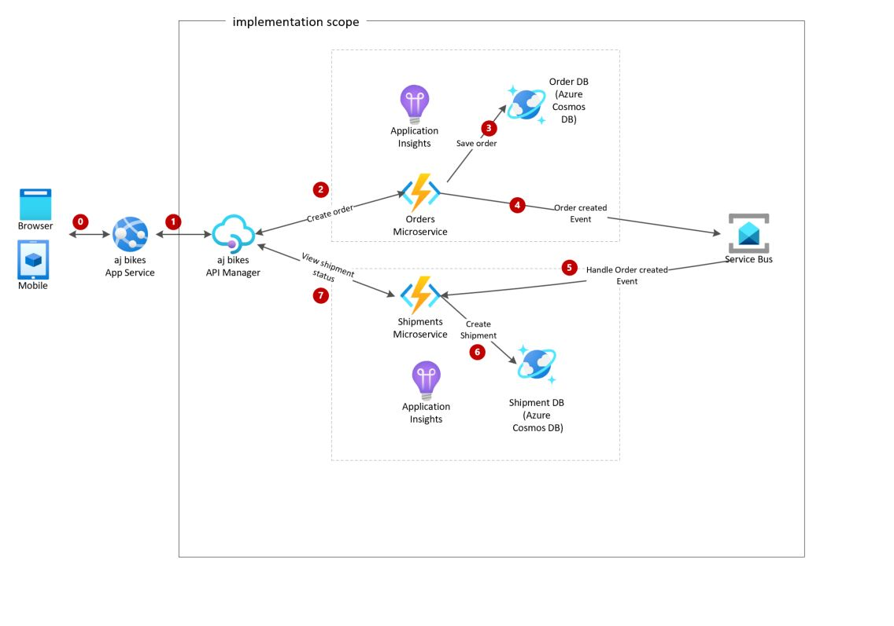
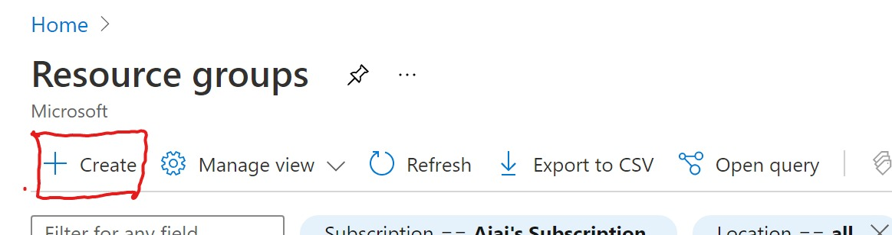
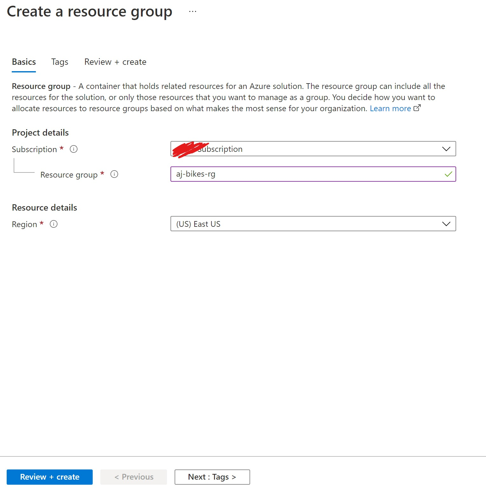
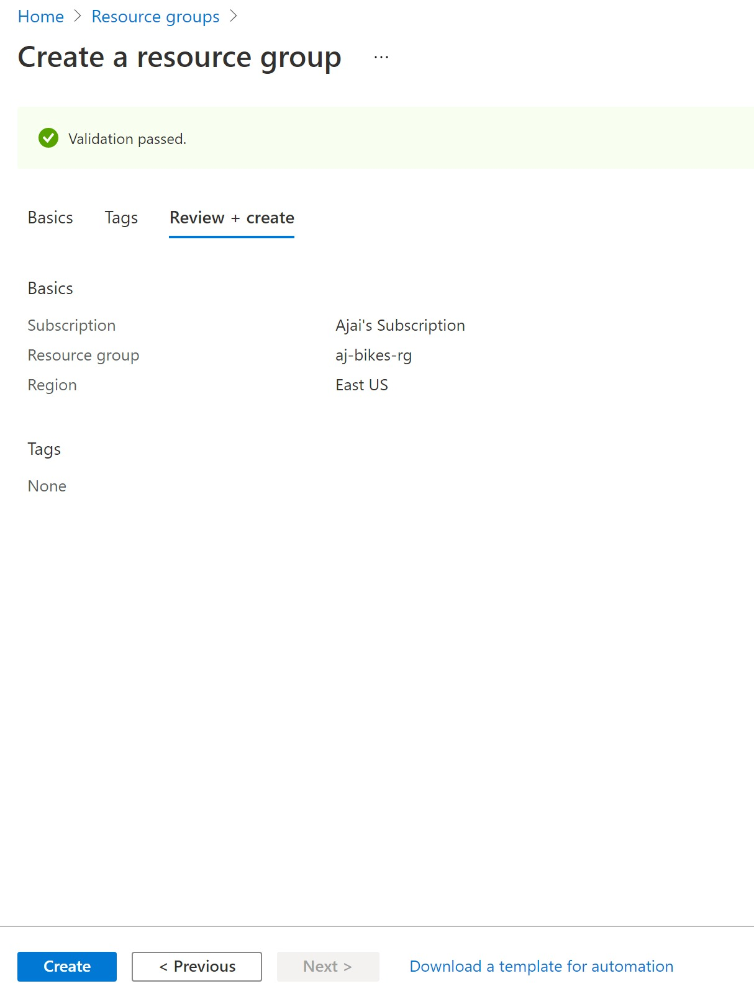

# Serverless Microservices - an example implementation

This tutorial provides step by step guidance for implementing an example serverless microservices architecture based on Azure serverless services. The following services are used in this implementation:
- Azure Functions
- Azure Cosmos DB
- Azure Service Bus
- Azure API Management
- Azure Application Insights

## Example scenario

Below is the architecture for the example implementation. 



## Steps:
- [Create a Resource Group that holds all the services used in this example](#u1)  
- [Create an ASP .NET application](#u2) based on the [sample application][2] available on github and deploy it to Azure App Service Web App created above.
- [Get Azure DevOps REST API access token using your application](#u3). 
- [Learn how to refresh the access token using a refresh token](#u4) 

## <a name="u1"> Create the Resource Group

   1. Login to Azure portal > In the top search bar start typing Resource Group > click on Resource Group
      
      
      ```
  
   2. Click on the + sign at the top left corner
      
        
      
   3. Select the subscription you want to use from the drop down > provide the resource group name > Select the region of your choice > click review and create  
   
         
       
   4.click on create.Resource group should be created momentarily.  
      
         
   
    
#### Register your Web App with Azure DevOps by following the steps below:

   1. Go to [https://app.vsaex.visualstudio.com/app/register][5]. This will open the Azure DevOps registration page as shown in the picture below. Fill out the fields as follows:   
   
         **Application Website:** URL of the Azure App Services Web App you created in step 4 above, https://{yoursite}.azurewebsites.net.  
         **Application callback URL :**  The callback url should be https://{yoursite}.azurewebsites.net/oauth/callback, where yoursite is the name  of your Azure Web App.  
         **Authorized scopes:** Work items (read and write)  
      
      You can fill in rest of the fields with any values.  
               
          
      
      
      After successful registration you should see a screen like this.  
      
      

## <a name="u2">  Create your ASP .NET application for getting OAuth access token and deploy it to Azure App Service Web Apps

 1. Clone or download the repo, [microsoft/azure-devops-auth-samples][3] from github.  

       
       
 2. Follow steps 2-5 in the [Azure DevOps OAuth sample app documentation][6] on github.

## <a name="u3">  Authorize your web application and get access token
   
   Follow the steps under **Run the sample** section in the [Azure DevOps OAuth sample app documentation][6] on github to obtain access and refresh tokens. Securely save these values. **You should keep these values secret.** 

## <a name="u4">  Refresh your access token as needed
   
   OAuth access tokens have an expiry time. Follow the steps [here][7] to get a new token before your access token expires. This tutorial shows how to refresh your token using Postman, however you will typically automate this in your application code.

**Next:** [Invoke Azure DevOps REST API with access token to create work items in Azure DevOps Boards.][8]

[Go to beginning of this tutorial][8]


[1]:https://docs.microsoft.com/en-us/azure/devops/integrate/get-started/authentication/oauth?view=azure-devops&viewFallbackFrom=vsts
[2]:https://github.com/microsoft/azure-devops-auth-samples/tree/master/OAuthWebSample
[3]:https://github.com/microsoft/azure-devops-auth-samples
[4]:https://portal.azure.com
[5]:https://app.vsaex.visualstudio.com/app/register
[6]:https://github.com/microsoft/azure-devops-auth-samples/tree/master/OAuthWebSample
[7]:https://github.com/aj3705/AzureDevOps/blob/master/restapis/refresh-token.md
[8]:https://github.com/aj3705/AzureDevOps/blob/master/restapis/create-ado-work-item.md
[9]:https://github.com/aj3705/AzureDevOps/blob/master/restapis/ado-rest-api-tutorial.md

