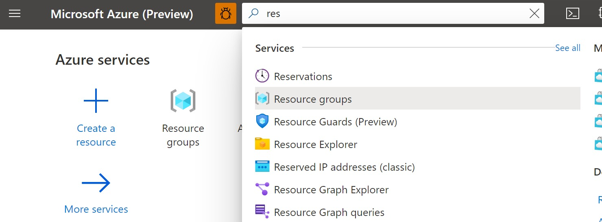

# Serverless Microservices - an example implementation

This tutorial provides step by step guidance for implementing an example serverless microservices architecture based on Azure serverless services. The following services are used in this implementation:
- Azure Functions
- Azure Cosmos DB
- Azure Service Bus
- Azure API Management
- Azure Application Insights

## Example scenario

Below is the architecture for the example implementation. 

0. Customer places an order for bikes on aj bikes website
1. Website sends a create order request to the Azure API Manager (APIM), the Microservices Gateway for aj bikes Microservices
2. APIM sends the create order request to Orders Microservice, which is implemented using Azure Functions. Azure Functions is a per per execution serverless service.
3. Orders Microservice stores the order in the Orders database implemented using Azure Cosmos DB 
4. Orders Microservice enqueues "Order Created" event in the Azure Service bus that is used for Microservices communications. 
5. Order Created Event triggers the Shipment Microservice implemented using Azure Functions
6. Shipment Microservice reads the order data in the Order Created event and creates a Shipment in the Shipments databas implemented using Azure Cosmos DB     
7. Shipment status is provided back to the customer via the APIM gateway.

## Steps:
1. [Create a Resource Group that holds all the services used in this example](#u1)  
2. [Create micro services](#u2)
   - [Create Cosmos DB for Orders Microservice data](#u2a)
   - [Create Function App for Orders Microservice APIs](#u2b)
   - [Create Order Creation Microservice API](#u2c)
   - [Create Cosmos DB for Shipments Microservice APIs](#u2d)
   - [Create Function App for Shipments Microservice APIs](#u2e)
   - [Create Shipment Creation Microservice trigger](#u2f)
   - [Create Shipment Status Microservice API](#u2g)
   - [Create Service Bus for Microservice communications](#u2h)
   - [Create API Management Gateway to front the Microservices](#u2i)
3. [Test your micro services](#u3). 
4. [Further reading](#u4) 

## <a name="u1"> 1. Create the Resource Group

   1. Login to Azure [portal][1] > In the top search bar start typing Resource Group > click on Resource Group
      
     
      
   2. Click on the + Create  at the top left corner
      
      
         
      
   3. Select the subscription you want to use from the drop down > provide the resource group name > Select the region of your choice > click review and create  
   
      
  
         
   4. Click Create.Resource group should be created momentarily. 
   
      
      
    
## <a name="u2"> 2. Create micro services

### <a name="u2a"> 2a. Create Cosmos DB for Order Microservice data
   
   1. Login to Azure [portal][1] > In the top search bar start typing Cosmos DB > Select Azure Cosmos DB
      
      
    
   
   2. Click on the + Create  at the top left corner
      
      
      
      
   3. Select the Core(SQL) API option  
   
      
  
         
   4. Provide the required values:
        
      In the default _Basics_ tab, provide the following values:
   
      _Resource Group:_ Select the resource group you created earlier.
   
      _Account Name:_ Enter a globally unique account name:_ajbikes-orders-db_
   
      _Location_: Select a location of your choice
   
      _Capacity mode_: Serverless
   
      
         
     
      Click "Backup Policy" tab at the top and slect "Locally-redundant backup storage" for Backup storage redundancy
         
      
   
   5. Click Review + Create > Create. Your Cosmos DB account should be created in a few minutes  
     
   6. Once the creation is complete, Go to your resource group and select the Cosmos DB that you just created
      
      Click Data Explorer in the left menu > Click New Container (top left) > Provide the following values:
   
      _Datebase id_: Select _Create new_ > provide a name like _ajbikes-orders-db_
   
      _Container id_: provide a name like _ajbikes-orders-container_
   
      _Partition key_: /id
   
      Leave the rest of the defaults and click OK. 
      
      
      
      After the container creation you should see an empty container like this:
     
      
   
### <a name="u2b"> 2b. Create Function App for Orders Microservice APIs
   
   1. Login to Azure [portal][1] > In the top search bar start typing Function App > Select Function App
      
      
    
   
   2. Click on the + Create  at the top left corner
     
        
   3. Provide the required values:
       
      _Resource Group:_ Select the resource group you created earlier.
   
      _Function App name:_ Enter a globally unique name:_ajbikes-orders-microservice_
   
      _Location_: Select a location of your choice
   
      _Runtime stack_: Node.js
   
      Leave other defaults and click Review + Create 
   
      
   
    
   4. Click Create. Your function will be created in a minute or so
      
      
   
   4. Click Create. Your function will be created in a minute or so
      
      
   

### <a name="u2c"> 2c. Create Order Creation Microservice
   
   
### <a name="u2d"> 2d. Create Cosmos DB for Shipments Microservice data
   
   Repeat the same steps you used in section [2a](#u2a)
 
### <a name="u2e"> 2e. Create Function App for Shipments Microservice APIs
   
   Repeat the same steps you used in section [2b](#u2b)  
   
### <a name="u2f"> 2f. Create Shipment Creation Microservice
   
### <a name="u2g"> 2g. Create Shipment Status Microservice
   
### <a name="u2h"> 2h. Create Service Bus for Microservice communications
   
   1. Login to Azure [portal][1] > In the top search bar start typing Service Bus > Select Service Bus
              
   
   2. Click on the + Create  at the top left corner
     
        
   3. Provide the required values:
       
      _Resource Group:_ Select the resource group you created earlier.
   
      _Namespace name:_ Enter a globally unique name:ajbikes
   
      _Location_: Select a location of your choice
   
      _Pricing toer_: Standard
   
      Leave other defaults and click Review + Create 
   
      
   
    
   4. Click Create. Your Service Bus will be created in a minute or so
        
   
### <a name="u2i"> 2i. Create API Management Gateway to front the Microservices
 

## <a name="u3"> 3. Test your micro services
   
   Follow the steps under **Run the sample** section in the [Azure DevOps OAuth sample app documentation][6] on github to obtain access and refresh tokens. Securely save these values. **You should keep these values secret.** 

## <a name="u4"> 4. Further reading
   
   OAuth access tokens have an expiry time. Follow the steps [here][7] to get a new token before your access token expires. This tutorial shows how to refresh your token using Postman, however you will typically automate this in your application code.

**Next:** [Invoke Azure DevOps REST API with access token to create work items in Azure DevOps Boards.][8]

[Go to beginning of this tutorial][8]

[1]:https://portal.azure.com

