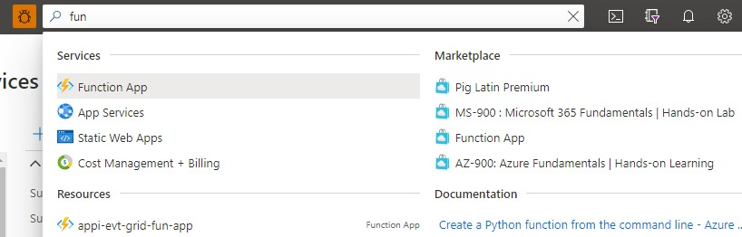
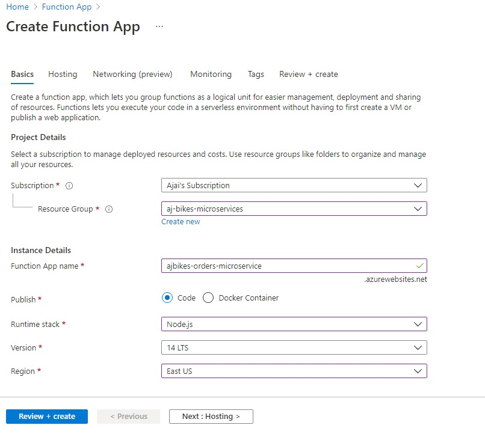

# <a name="home"> Serverless Microservices - an example implementation

This tutorial provides step by step guidance for implementing an example serverless microservices architecture based on Azure serverless services. The following services are used in this implementation:
- Azure Functions
- Azure Cosmos DB
- Azure Service Bus
- Azure API Management
- Azure Application Insights

## Example scenario

Below is the architecture for the example implementation. 

0. Customer places an order for bikes on aj bikes website
1. Website sends a create order request to the Azure API Manager (APIM), the Microservices Gateway for aj bikes Microservices
2. APIM sends the create order request to Orders Microservice, which is implemented using Azure Functions. Azure Functions is a pay per execution serverless service.
3. Orders Microservice stores the order in the Orders database implemented using Azure Cosmos DB 
4. Orders Microservice enqueues "Order Created" event in the Azure Service Bus Queue which is used for Microservices communications. 
5. Order Created event triggers the Shipment Microservice implemented using Azure Functions
6. Shipment Microservice reads the order data in the Order Created event and creates a Shipment in the Shipments database implemented using Azure Cosmos DB     
7. Shipment status is provided back to the customer via the APIM gateway.

## Steps:
1. [Create a Resource Group that holds all the services used in this example](#u1)  
2. [Create micro services](#u2)
   - [Create Cosmos DB for Orders Microservice data](#u2a)
   - [Create Service Bus for Microservice communications](#u2b)
   - [Create Function App for Orders Microservice APIs](#u2c)
   - [Create Order Creation Microservice API](#u2d)
   - [Create Cosmos DB for Shipments Microservice APIs](#u2e)
   - [Create Function App for Shipments Microservice APIs](#u2f)
   - [Create Shipment Creation Microservice trigger](#u2g)
   - [Create Shipment Status Microservice API](#u2h)
   - [Create API Management Gateway to front the Microservices](#u2i)
3. [Test your micro services](#u3). 
4. [Further reading](#u4) 

## <a name="u1"> 1. Create the Resource Group

   1. Login to Azure [portal][1] > In the top search bar start typing Resource Group > click on Resource Group
      
     
      
   2. Click on the + Create  at the top left corner
      
      
         
      
   3. Select the subscription you want to use from the drop down > provide the resource group name > Select the region of your choice > click review and create  
   
      
  
         
   4. Click Create.Resource group should be created momentarily. 
   
      
   
[home](#home)                                                                                                           
    
## <a name="u2"> 2. Create micro services

### <a name="u2a"> 2a. Create Cosmos DB for Order Microservice data
   
   1. Login to Azure [portal][1] > In the top search bar start typing Cosmos DB > Select Azure Cosmos DB
      
      
    
   
   2. Click on the + Create  at the top left corner
      
      
      
      
   3. Select the Core(SQL) API option  
   
      
  
         
   4. Provide the required values:
        
      In the default _Basics_ tab, provide the following values:
   
      _Resource Group:_ Select the resource group you created earlier.
   
      _Account Name:_ Enter a globally unique account name:_ajbikes-orders-db_
   
      _Location_: Select a location of your choice
   
      _Capacity mode_: Serverless
   
      
         
     
      Click "Backup Policy" tab at the top and slect "Locally-redundant backup storage" for Backup storage redundancy
         
      
   
   5. Click Review + Create > Create. Your Cosmos DB account should be created in a few minutes  
     
   6. Once the creation is complete, Go to your resource group and select the Cosmos DB that you just created
      
      Click Data Explorer in the left menu > Click New Container (top left) > Provide the following values:
   
      _Datebase id_: Select _Create new_ > provide a name like _ajbikes-orders-db_
   
      _Container id_: provide a name like _ajbikes-orders-container_
   
      _Partition key_: /id
   
      Leave the rest of the defaults and click OK. 
      
      
      
      After the container creation you should see an empty container like this:
     
      

[home](#home)

### <a name="u2b"> 2b. Create Service Bus for Microservice communications
   
   1. Login to Azure [portal][1] > In the top search bar start typing Service Bus > Select Service Bus
              
   
   2. Click on the + Create  at the top left corner
     
        
   3. Provide the required values:
       
      _Resource Group:_ Select the resource group you created earlier.
   
      _Namespace name:_ Enter a globally unique name:ajbikes
   
      _Location_: Select a location of your choice
   
      _Pricing toer_: Standard
   
      Leave other defaults and click Review + Create 
   
      
   
    
   4. Click Create. Your Service Bus will be created in a minute or so
   
   5. Go to your Service Bus and click on Queues in the left menu > Click +Queue at the top left
      
      Enter ajbikes-microservice-messsaging in the name field. Accept other defaults and click Create.
      
      
      
      Queue will be created in a few seconds.
   
   
### <a name="u2c"> 2c. Create Function App for Orders Microservice APIs
   
   1. Login to Azure [portal][1] > In the top search bar start typing Function App > Select Function App
      
      
    
   
   2. Click on the + Create  at the top left corner
     
        
   3. Provide the required values:
       
      _Resource Group:_ Select the resource group you created earlier.
   
      _Function App name:_ Enter a globally unique name:_ajbikes-orders-microservice_
   
      _Location_: Select a location of your choice
   
      _Runtime stack_: Node.js
   
      Leave other defaults and click Review + Create 
   
      
   
    
   4. Click Create. Your function will be created in a minute or so

   
[home](#home)
   
### <a name="u2d"> 2d. Create Order Creation Microservice API
   
   1. In the top search bar start typing Function App > Select Function App
      
      Click Functions >Functions in the left menu > click Create at the top left corner
      
      
    
   
   2. Select Http trigger > Change the function name to CreateOrder. 
      
      Make sure Development environment is selected to _Develop in portal_
      
      Click Create. This will create the function and open the CreateOrder function page.
   
      
      
   3. __Add bindings__: Before we add the Create Order code, we will first bind this function to Orders Cosmos DB, so that this function can read from and write data to Orders Cosmos DB. We will also create an output binding to the Service Bus Message queue that we created earlier, so that the Order microservice can communicate with the Shipment microservice via service bus.
      
      Click on Integration in left menu. This will open up the Integration page. You will see a pictorial view of the Trigger, Input bindings and Output bindings. 
      
      
   
      __3a.Click Inputs > Add input__
      
      -  Select Azure Cosmos DB from the Binding Type drop down.
      
      -  Click on New under the Cosmos DB account connection drop down > select Azure Cosmos DB Account radio button 
     
      -  Select the ajbikes-orders-db Cosmos database you created earlier > Click OK
      
         
      
      -  Provide the following values and click OK:  
      
         -  Document parameter name: order
   
         -  Database name: ajbikes-orders-db (name of the orders cosmos db you created earlier)
   
         -  Collection name: ajbikes-orders-container (name of the container you created earlier)
   
         -  Document ID : {id}
   
         -  Partition key : {id}
      
         
   
      __3b.Click Outputs > Add Outputs__ 
      
      -  Provide the following values and click OK:
   
         -  Binding type : Azure Cosmos DB.
   
         -  Cosmos DB account connection: this will be prepopulated to the connection you created in the earlier step. Leave it as is
   
         -  Document parameter name : neworder
   
         -  Datebase name: ajbikes-orders-db
   
         -  Collection name: ajbikes-orders-container
   
         -  partition key: /id
      
         
   
      __3c.Click Outputs > Add Outputs__
      
      -  Provide the following values and click OK:
   
         -  Binding type : Azure Service Bus.
   
         -  Message type : Service Bus Queue
   
         -  Service Bus connection: Click New >  Service Bus Connection: ajbikes service bus you created earlier. Leave other defaults and click OK.
   
         -  Message paramter name : leave the default (outputSbMsg)
   
         -  Queue name : ajbikes-microservice-messsaging ( service bus queue that you created earlier)
      
         Your output binding should look like this after it is created: 
   
         
     
      
        
   4. __Add Code to CreateOrder function__:
   
   -  Go to CreateOrder function that you created earlier and  click on Code+Test in the left menu
   
   -  Make sure index.js is selected in the drop down. 
   
   -  Replace the entire code with the code in [src/create_order.js][2] and click save
      
      

[home](#home)
   
### <a name="u2e"> 2d. Create Cosmos DB for Shipments Microservice data
   
   Repeat the same steps you used in section [2a](#u2a)
   
   This tutorial uses the following values
   - Cosmos DB Account name : ajbikes-shipments-db
   - Database name : ajbikes-shipments-db
   - Container name : ajbikes-shipments-container
   - Partition key: /id
 
### <a name="u2e"> 2f. Create Function App for Shipments Microservice APIs
   
   Repeat the same steps you used in section [2b](#u2b)  
   This tutorial uses the following values:
   -  Function App name: ajbikes-shipments-microservice
   
   
### <a name="u2g"> 2g. Create Shipment Creation Microservice API
   
   1. Go to ajbikes-shipments-microservice function app and create a new fuction called CreateShipment. Folow similar [steps](#u2d) that you used to create CreateOrder function, with the followng changes:
   
   -  Trigger : Azure Service Bus Queue Trigger
 
   -  Click New under Server Bus Connection > select the ajbikes service bus you created earlier. Click OK
   
   -  Que name: ajbikes-microservice-messsaging
   
      
   
   2. Following similar [steps](#u2d) you used for adding output bindings to CreateOrder function, add a Cosmos DB output binding to CreateShipment function, with the following changed:
   
   -  Cosmos DB Account connection : ajbikes-shipments-db
   
   -  Document parameter name : newshipment
   -  Database name : ajbikes-shipments-db
   -  Collection name: ajbikes-shipments-container
   -  Partition key: /id
   
      
   
   3. _Add code to CreateShipment function._
      
      -  Go to CreateShipment function that you created earlier and  click on Code+Test in the left menu
   
      -  Make sure index.js is selected in the drop down. 
   
      -  Replace the entire code with the code in [src/create_shipment.js][3] and click save

[home](#home)
### <a name="u2h"> 2h. Create Shipment Status Microservice
   
       1. Go to ajbikes-shipments-microservice function app and create a new fuction called CreateShipment. Folow the same [steps](#u2d) that you used to create CreateOrder function, with the followng values:
   
      -  Trigger: Http Trigger
      -  Name: ShipmentStatus
      
       2. Following similar [steps](#u2d) you used for adding input bindings to CreateOrder function, add a Cosmos DB input binding to CreateShipment function, with the following values:
   
      -  Cosmos DB Account connection : ajbikes-shipments-db
      -  Document parameter name : shipment
      -  Database name : ajbikes-shipments-db
      -  Collection name: ajbikes-shipments-container
      -  Document id :{id}
      -  Partition key: {id}
     
      3. _Add code to ShipmentStatus function._
      
      -  Go to ShipmentStatus function that you created earlier and  click on Code+Test in the left menu
   
      -  Make sure index.js is selected in the drop down. 
   
      -  Replace the entire code with the code in [src/shipment_status.js][4] and click save

[home](#home)

        
   
### <a name="u2i"> 2i. Create API Management Gateway to front the Microservices
   
   The last step is to front your Microservices with an API Management Gateway.Follow these steps to Create an API Management Gateway
   
   #### OrderCreate Microservice
   
      1. Go to your ajbikes-orders-microservice Function App

      2. Click on API Management in the left menu

      3. Click _Create new_ under the API Management dropdown 

         

      4. Enter the required values:

         -  Name: ajbikes-microservices-apim
         -  Organization name : ajbikes
         -  Accept rest of the defaults

         Click Export. 

         
   
      5. Once APIM is linked,you will be redirected to APIM Management blade. If not, go back to the API Management blade in the ajbikes-orders-microservice Function App by clicking on API Management in the left menu. After that perform the following steps.
   
         -  Click Enable Application Insights and click Link API
            
              
   
         - Select CreateOrder if it's not already selected, Click Selct.
   
              
   
         -  Change API URL suffix to ajbikes-orders. Accept all other defaults and click Create
      
              
         
  #### ShipmentStatus Microservice 
   
  Repeat the above steps for ShipmentStatus Microservice, but this time instead of creating a new APIM select the ajbikes-microservices-apim that was created in the earlier step.Use ajbikes-shipments for API URL suffix and accept the rest of the values.
   
  
 
[home](#home)
## <a name="u3"> 3. Test your micro services
 
 Now that you have implemented the solution, it's time to test it end to end to make sure the soultion is functioning as expected. 
   
 1. Go to ajbikes-microservices-apim that we created earlier and click on APIs in the left menu. You will two APIs ajbikes-orders-microservice and ajbikes-shipments-microservice.
 
 2. Click ajbikes-orders-microservice > Click Test tab > Select _POST CreateOrder_
    
      
 
 3. Copy the json file from  [src/create_order_request.json][5] and paste it into the Request body (make sure Raw is selected). __Note:__You can create as many orders as you want as long as you use a different order id each time.
   
      
 
 4. Click Send. You should get an order created successfully message. 
      
      
 
 ### What happend behind the scenes ? 
  
 Exactly what was laid our in the architecture diagram.  
   
   - 1. APIM sent the Order to CreateOrder API (function) of the ajbikes-orders Microservice, 
   - 2. The  CreateOrder function stored the record in ajbikes-order-db and enqued Order message  in the ajbikes-microservice-messsaging Azure Service Bus Queue
   - 3. Service Bus Queue triggered the CreateShipment function of the ajbikes-shipments-microservice which processes the message and created a Shipment in the  ajbikes-shipments database
 
   Now let's get the status of the shipment for this order. 
   
      1. Go back to API Management > APIs
      2. Select ajbikes-shipments-microservice > Click Test tab > Click POST ShipmentStatus
      3. Copy the json file from  [src/shipment_status_request.json][6] and paste it into the Request body (make sure Raw is selected). Note that the shipment id is created based on this convention: shipmentid = shipment+orderid
      4. Click send
      5. You should get the Shipment Status Message.
   
         
  
   ### How to verify the data flow across the components in the solution. 
   
      1. Go to ajbikes-orders-microservice . You will see the function execution count for all functions in the overview page
      
          
   
      2. Click on Functions > Create Order Function. You will see successful execution count for the Create Order function.
      
          
   
      3. Click monitor and click the last execution. You will see the function logs, that order is being created.
   
         
      
      4. Go to ajbikes Service Bus > ajbikes-microservice-messaging Service Bus Queue. In the overview page you will see the incoming anf out going message counts
   
         
   
      5. Go to ajbikes Service Bus > Click Monitoring > Insights(Preview) in the left menu > Click on Messages. You can see the incoming and outgoing message counts 
         
         
      
      6. Repeat steps 1-3 for ajbikes-shipments-microservice/CreateShipment function. You can see the CreateShipment function logs indicating that a shipment is created for the Order message that was received through Azure Service Bus
   
          
   
      7. Finally you can see the order and shipment in the  ajbikes-orders-db and ajbikes-shipments-db databases:
   
           
   
          
         
                  
   
   
[home](#home)
## <a name="u4"> 4. Further reading
   
This tutorial is intended to show case the art of the possible - How you can quickly and easiliy build production grade micro service architectures usning Azure Serverless services. This is not meant to provide indepth implementation guidence. Distributed tracing and Security are also out of the scope of this tutorial. Hope this whet your apetitie for serverless and microsevrices and that you will dig deeper to learn more and build some cool servless applications. Here is the for futher learning on this topic: 
   
https://azure.microsoft.com/en-us/blog/building-serverless-microservices-in-azure-sample-architecture/

[1]:https://portal.azure.com
[2]:https://github.com/aj3705/serverless-microservices/blob/main/src/orders/create_order.js
[3]:https://github.com/aj3705/serverless-microservices/blob/main/src/shipments/create_shipment.js  
[4]:https://github.com/aj3705/serverless-microservices/blob/main/src/shipments/shipment_status.js
[5]:https://github.com/aj3705/serverless-microservices/blob/main/test/create_order_request.json
[6]:https://github.com/aj3705/serverless-microservices/blob/main/test/shipment_status_request.json

